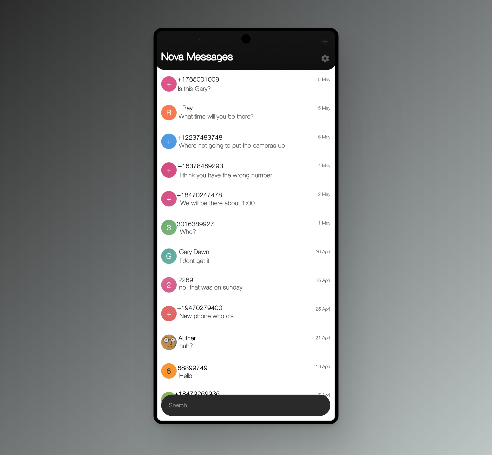
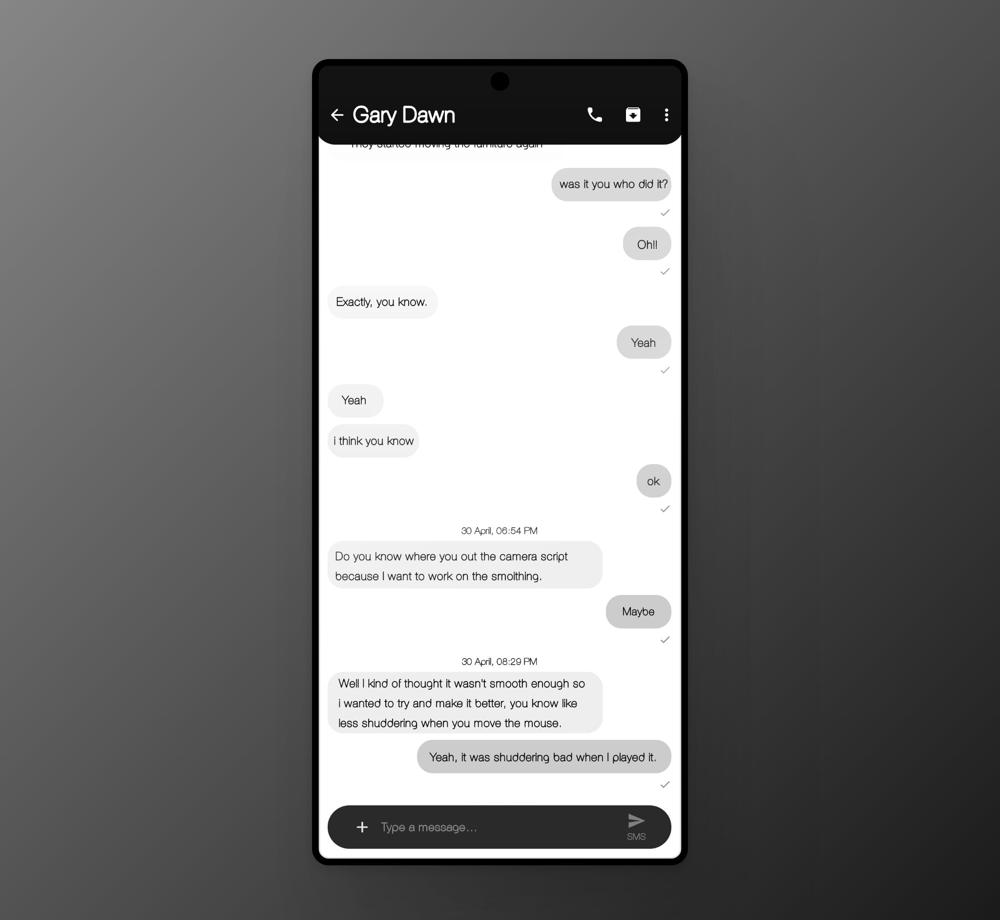

# Nova Messages

Nova Messages is your trusted messaging companion, designed to enhance your messaging experience in various ways.

**📱 STAY CONNECTED WITH EASE:**  
With Nova Messages, you can effortlessly send SMS and MMS messages to stay connected with your loved ones. Enjoy SMS/MMS based group messaging and express yourself with photos, emojis, and quick greetings.

**🚫 BLOCK UNWANTED MESSAGES:**  
Take control of your messaging experience with a robust blocking feature, easily preventing unwanted messages, even from unknown contacts. You can also export and import blocked numbers for hassle-free backup. Additionally, customize your experience by preventing messages with specific words or phrases from reaching your inbox.

**🚀 LIGHTNING-FAST AND LIGHTWEIGHT:**  
Despite its powerful features, Nova Messages boasts a remarkably small app size, making it quick and easy to download and install. Experience speed and efficiency while enjoying the peace of mind that comes with SMS backup.

**🔍 EFFICIENT MESSAGE SEARCH:**  
Say goodbye to endless scrolling through conversations. Nova Messages simplifies message retrieval with a quick and efficient search feature. Find what you need, when you need it.

**🌈 MODERN DESIGN & USER-FRIENDLY INTERFACE:**  
Enjoy a clean, modern design with a user-friendly interface.

**🌐 OPEN-SOURCE TRANSPARENCY:**  
Your privacy is a top priority. Nova Messages operates without requiring an internet connection, guaranteeing message security and stability. Our app is completely free of ads and does not request unnecessary permissions. Moreover, it is fully open-source, providing you with peace of mind, as you have access to the source code for security and privacy audits.

Make the switch to Nova Messages and experience messaging the way it should be – private, efficient, and user-friendly. Download now and join our community committed to safeguarding your messaging experience.

**Install**
Sometimes when you install it you need to allow restricted settings, then in the app info settings allow all permissions, clear cache if there's cache, then force stop it and it should work

