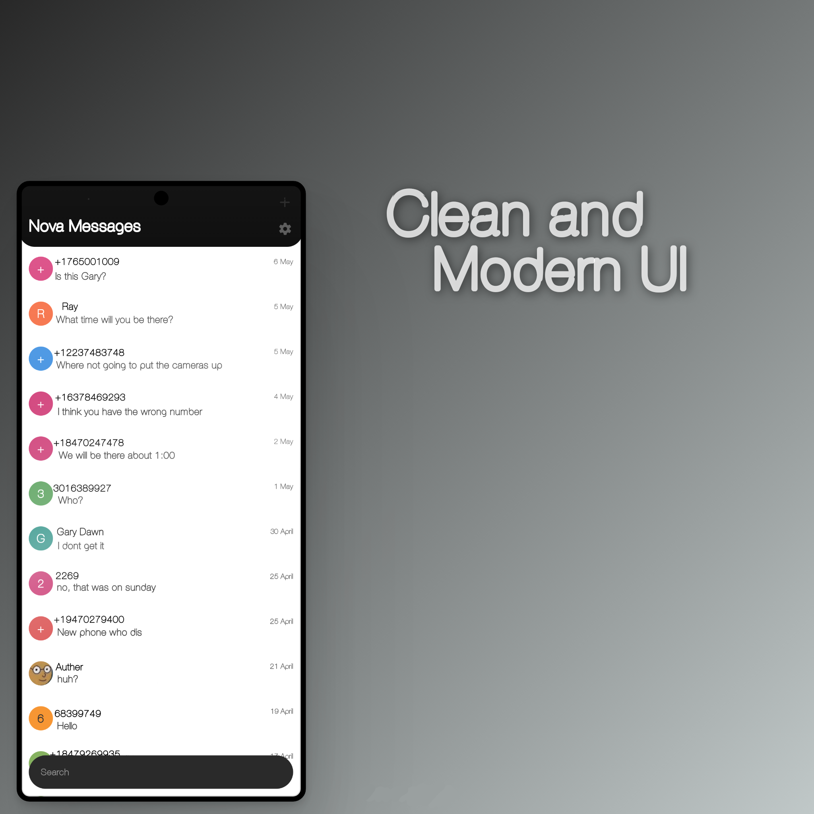
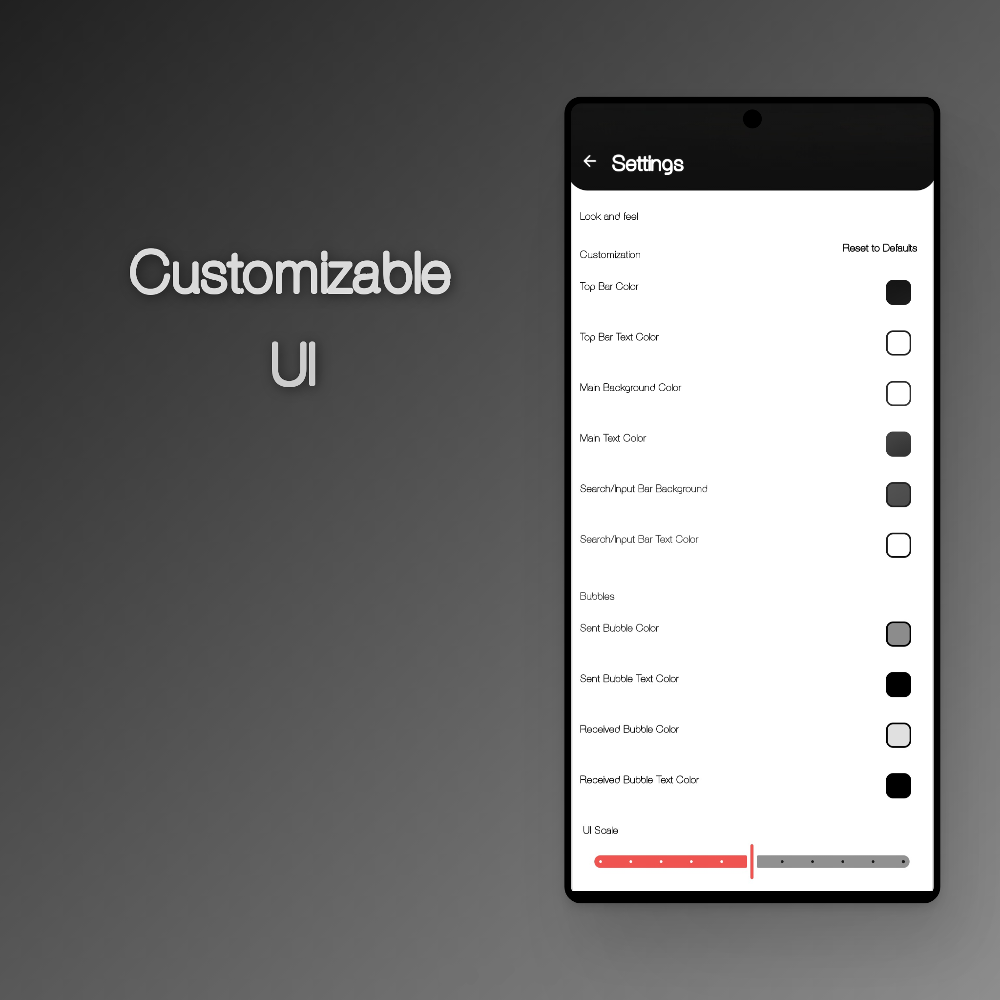

**Introducing Nova Messages: Your Ultimate Messaging Companion**

Imagine a world where messaging is not just a means of communication, but an experience that brings people closer together. Welcome to Nova Messages, your trusted messaging companion designed to revolutionize the way you connect with loved ones, friends, and colleagues.

**Stay Connected with Ease**

With Nova Messages, you can effortlessly send SMS and MMS messages to stay connected with your loved ones. Whether you're sharing a funny meme, a heartfelt message, or a quick greeting, our app makes it easy to express yourself. Enjoy the following features:

• Group Messaging: Send messages to multiple contacts at once, making it perfect for family gatherings, team meetings, or social events.
• Photos and Emojis: Share your favorite memories, express your emotions, and add a personal touch to your messages.
• Quick Greetings: Send pre-designed greetings to make your messages more engaging and personalized.

**Take Control of Your Messaging Experience**

Say goodbye to unwanted messages and hello to a clutter-free inbox. Nova Messages offers a robust blocking feature that allows you to:

• Block Unwanted Contacts: Easily prevent messages from unknown contacts or numbers you don't want to hear from.
• Export and Import Blocked Numbers: Back up your blocked numbers for hassle-free management.
• Customize Your Experience: Prevent messages with specific words or phrases from reaching your inbox, giving you complete control over your messaging experience.

**Lightning-Fast and Lightweight**

Despite its powerful features, Nova Messages boasts a remarkably small app size, making it quick and easy to download and install. Experience speed and efficiency while enjoying the peace of mind that comes with SMS backup.

**Efficient Message Search**

Say goodbye to endless scrolling through conversations. Nova Messages simplifies message retrieval with a quick and efficient search feature. Find what you need, when you need it.

**Modern Design & User-Friendly Interface**

Enjoy a clean, modern design with a user-friendly interface that makes it easy to navigate and use.

**Open-Source Transparency**

Your privacy is a top priority. Nova Messages operates without requiring an internet connection, guaranteeing message security and stability. Our app is completely free of ads and does not request unnecessary permissions. Moreover, it is fully open-source, providing you with peace of mind, as you have access to the source code for security and privacy audits.

**Make the Switch to Nova Messages**

Experience messaging the way it should be – private, efficient, and user-friendly.

install - sometimes when its installed you have to allow restricted settings with the android tutorial, then clear cache and force stop it and it should work.

